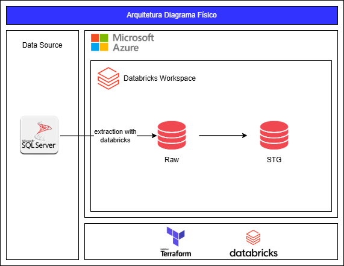

# Lighthouse Challenge Indicium

## Project Description
This project was developed as the final stage of the Lighthouse program, aiming to evaluate participants technically and track their progress throughout the program.

## Introduction
The project involves creating infrastructure in Databricks using Terraform to extract data from an MSSQL database into a raw catalog in Databricks, followed by transformations and loading into an stg catalog. Each stage is documented below with direct links for easier navigation:

- [Setting Up the Environment](#setting-up-the-environment)
- [Infrastructure](#infrastructure)
- [Development](#development)
  - [Extraction](#extraction-mssql_to_raw)
  - [Transformation](#transformation-raw_to_stg)
- [Job Execution](#job-execution)
- [Conclusion](#conclusion)

## Setting Up the Environment
Installations followed the official documentation for each tool:

1. Terraform: [Install Terraform CLI](https://developer.hashicorp.com/terraform/tutorials/azure-get-started/install-cli)
2. Azure CLI: [Install Azure CLI on Linux](https://learn.microsoft.com/en-us/cli/azure/install-azure-cli-linux?pivots=apt)
3. Databricks CLI: [Install Databricks CLI](https://docs.databricks.com/en/dev-tools/cli/install.html)

Additionally, we used the Databricks extension in VSCode to facilitate connection and interaction with the platform. All activities were performed in a Windows + WSL environment.

## Infrastructure
Infrastructure was created using Terraform. Configurations included:

- Raw and stg catalogs and their respective schemas.
- Sensitive variable configuration in the `.env` file.
- Connection to Databricks on Azure using a platform-generated token.

Key files include:

- `main.tf`: Defines the resources to be created.
- `variables.tf`: Defines the variables used in the project.



### Deployment Commands for Infrastructure
1. Initialization: `terraform init`
2. Planning: `terraform plan`
3. Application: `terraform apply`

With the infrastructure ready, we moved on to developing the notebooks.

## Development
Development involved two main notebooks created in the `src` folder:

1. **Extraction** ([mssql_to_raw](#extraction-mssql_to_raw)): Connects to the MSSQL database and extracts tables into the raw catalog.
2. **Transformation** ([raw_to_stg](#transformation-raw_to_stg)): Applies transformations to the data and loads it into the stg catalog.

### Extraction [mssql_to_raw]
Each notebook cell performs a specific task:

1. **Spark Session Configuration:** Creates the Spark session for executing operations.
2. **MSSQL Database Connection:** Configures the JDBC URL and connection properties.
3. **Reading and Writing:** Extracts tables from the MSSQL database and writes them to the Databricks raw catalog.

### Transformation [raw_to_stg]
Each notebook cell performs a specific task:

1. **Loading Metadata:** Reads the `transformations.yml` file for transformation details.
2. **Transformation Function:** Applies snake_case rules and casts defined in the YAML file.
3. **Processing XML Columns:** Expands XML columns into separate columns based on their values.
4. **Validation:** Checks if tables were correctly loaded into the stg catalog.

## Job Execution
Jobs were configured and executed using Databricks Bundles. During development, we used the command:

```bash
databricks bundle deploy -t dev
```

After validations, the production environment was configured with:

```bash
databricks bundle deploy -t prod
```

## Conclusion
The project met the challenge requirements, demonstrating technical skills in setting up infrastructure, developing data pipelines, and automating processes in Databricks. This was an opportunity to consolidate knowledge gained during the Lighthouse program.
